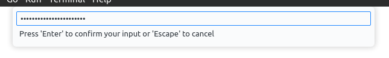

# Setting up the coursework (a guide)

This guide aims to help you set up the coursework either using VSCode, 
or by working on a local copy. See 
[here](#setting-up-the-coursework-with-vscode) for the former and 
[here](#setting-up-the-coursework-locally) for the latter.

After you've done that, you can go [here](#setting-up-infos) to get 
started with the coursework.

## Important note

**This is not guaranteed to work**. This is supposed to be a helpful 
guide, but I am not responsible for any long-term pain that might result
from use of this guide. **If you set up locally, I have no idea if it 
will actually let you submit**. I am 99% sure it's fine, and worst case,
just copy your files over.

# Setting up the coursework with VSCode

## Install 'Remote - SSH'

You will need to make sure you have a working `ssh` command set up.
Refer to the lab sheet for this. It's called something like 
'infos-coursework-preliminary.pdf'. Mostly you need to worry about the 
actual NMES page for connecting to bastion.

1. Hit `Ctrl + Shift + X` to open up the extension manager
2. Search for "remote ssh" and select the first one (It should be called 
   "Remote - SSH")
3. Install it


1. `Ctrl + Shift + P` This opens the command palette.
2. Type "Developer: Reload Window"
3. Select `Developer: Reload Window` and hit `Enter` or just clicking it
   is probably fine. **From now on, these last three steps will be 
   just written as "execute `Command` using the command palette".**

## Connecting to the OSC machine

Time to connect your VSCode workspace to the remote OSC machine. First
we set up our ssh config so that we can access the host quickly, then
we connect to it.

1. Execute `Remote-SSH: Open SSH Configuration File...` using the 
   command palette.
2. Choose the top configuration file, what exactly this file is depends
   on your OS, but hopefully the following works on any OS.
3. Copy and paste this into your config file **and save it**. Make sure
   your replace `kxxxxxxxx` with your actual k-number.

```py
# The remote host for our coursework
Host OSC
    HostName 5CCS2OSC.nms.kcl.ac.uk
    ProxyJump kxxxxxxxx@bastion.nms.kcl.ac.uk
    User kxxxxxxxx

# Set a 60 second keep alive in case there is no activity.
Host *
    ServerAliveInterval 60
```

4. Execute `Remote-SSH: Connect to Host...` using the command palette.
5. Select `OSC`
6. This should open a new window and you will be prompted to enter your
   password. 
7. See the section [Troubleshooting](#troubleshooting) for more



## Troubleshooting

### I can't enter my password fast enough and it times out!

1. Execute `Remote-SSH: Settings` using the command palette
2. Find 'Connnect Timeout'
3. Set this to a longer duration than 15 seconds.
   1. You can also do this by adding `"remote.SSH.connectTimeout": 100`
      to your `settings.json` if you prefer. Of course, `100` is just
      an example value.

# Setting up the coursework locally

I much prefer working on things locally. Here's how you can do that.
There are easier ways of doing this, but this should hopefully be quite
future proof against anything that might be user-specific, so I would 
recommend everyone do this, instead of just copying someone else's 
local InfOS skeleton.

1. Install a bunch of stuff...
   1. Install qemu. This is OS-specific, so work it out.
   2. Install **GCC**. Don't use Clang. InfOS invokes some undefined 
      behavior and I bet Clang actually notices.
   4. Install make.
   5. Install bash.
   6. Install git.
2. [Setup InfOS](#setting-up-infos) on the remote machine. You should 
   now have `infos`, `infos-user` and `run-infos` all in the same 
   folder. Please make sure you are in this folder.
3. Run the following commands (you could just make a `.sh` file)

```sh
mkdir allweneed
cp -r infos allweneed/infos
cp -r infos-user allweneed/infos-user
tar -czvf allweneed.tar.gz allweneed/
```

4. This should have made an archive that you can copy to your local 
   machine. Type the following command to get the exact path of the 
   tarball.

```sh
realpath -s allweneed.tar.gz
```

This will output a path. From now on I wall call this file path
`<allweneed-path>`. Wherever you see this token, please replace it with 
the output of the above command

5. Disconnect from the remote host E.g. on Linux, press `Ctrl + D`.
6. Copy the archive to any local directory of your choice, here is a 
   template. You are copying to `<local-folder>`, which should be 
   replaced by some path on your local machine. 

```sh
scp -J kxxxxxxxx@bastion.nms.kcl.ac.uk \
kxxxxxxxx@5CCS2OSC.nms.kcl.ac.uk:<allweneed-path> \
<local-folder>
```

An example of a full command:

```sh
scp -J k21052695@bastion.nms.kcl.ac.uk \
k21052695@5CCS2OSC.nms.kcl.ac.uk:/home/k21052695/allweneed.tar.gz \
/home/oli/Documents/School/Coursework/OSC/infos-local
```

This should prompt you to enter your password, as you normally would 
with ssh. **Note that you can now safely remove `allweneed/` and the 
created archive from the remote machine.**

7. Extract the contents of the tarball, you could also rename 
   `allweneed` to something better. Here, I just assume that you name
   it `allweneed`.

```sh
cd <local-folder>
tar -xzvf ./allweneed.tar.gz -C ./
```

8. We need to make everything again

```sh
cd ./allweneed/infos
make
cd ../infos-user
make
make fs
``` 

9.  We can't use the normal `./run-infos` Makefile, so we need to do it
   ourself. You might want to make this a script. This has been taken
   from [the InfOS repository](https://github.com/tspink/infos).

```sh
qemu-system-x86_64 -m 8G \
  -kernel ../infos/out/infos-kernel \
  -debugcon stdio \
  -hda bin/rootfs.tar \
  -append 'pgalloc.debug=0 pgalloc.algorithm=simple objalloc.debug=0 sched.debug=0 sched.algorithm=cfs syslog=serial boot-device=ata0 init=/usr/init'
```


10. Yay, you did it! In order to submit things, we have to copy things
    back to the remote machine. Use `scp` for this, in much the same way
    we did before.

# Setting up InfOS

This section is about how to set up InfOS on the remote OSC machine.

1. Connect to the remote host. Again, replace `kxxxxxxxx` with your 
   k-number.

```sh
ssh -J kxxxxxxxx@bastion.nms.kcl.ac.uk kxxxxxxxx@5CCS2OSC.nms.kcl.ac.uk
```

1. Execute the following commands wherever you want to work on InfOS.
   (probably not your home directory).

```sh
git clone /shared/5CCS2OSC/infos
git clone /shared/5CCS2OSC/infos-user
cd infos && make && cd ..
ln -s /shared/5CCS2OSC/run-infos .
```

3. Execute `./run-infos`.

```sh
./run-infos
```